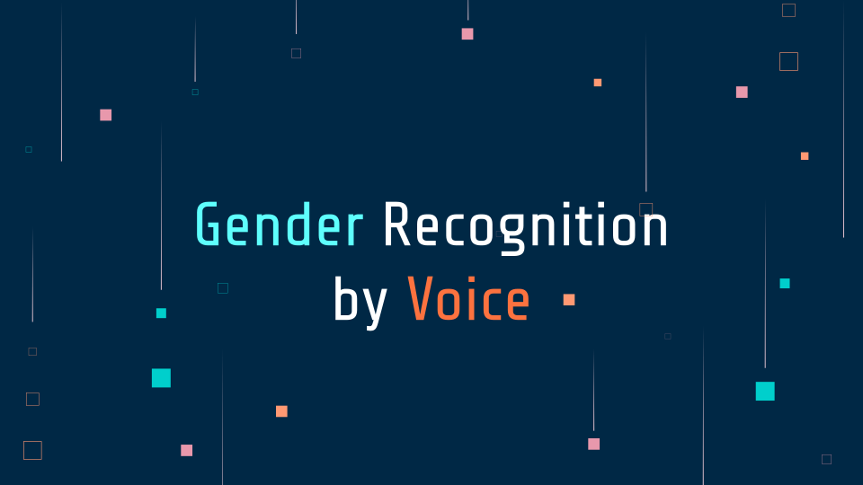
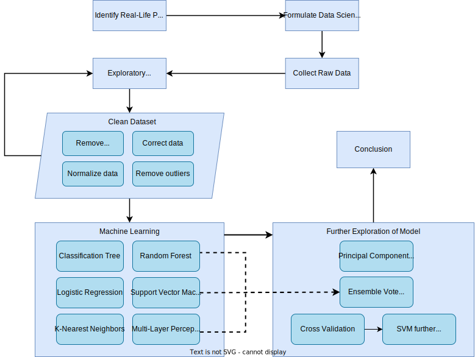
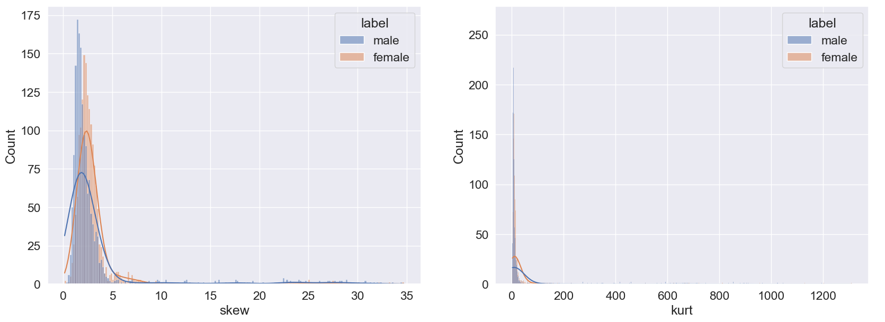
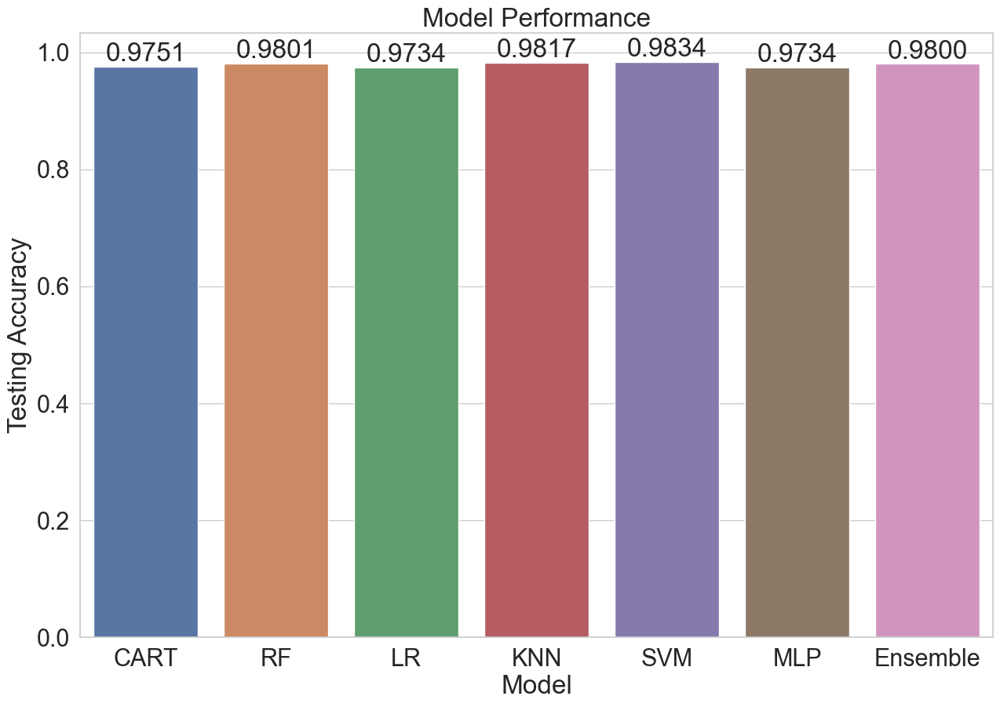

Welcome to our project for the NTU course *SC1015 Introduction to Data Science and Artificial Intelligence*!

In this project, we explore the relationship between sound data and the gender of the speaker, and develop models to estimate the gender of a speaker based on various features.

The main page of our project is [here](https://pufanyi.github.io/GenderRecognitionByVoice).

And our presentation video is [here](https://youtu.be/sWD81_SmO8E).

## Content

All code is located under the src directory.

Please read through the code in the flowing sequence:

- [`DataPreparationAndExploration.ipynb`](./src/DataPreparationAndExploration.ipynb)
- [`GenderRecognitionUsingTreeBasedAlgorithms.ipynb`](./src/GenderRecognitionUsingTreeBasedAlgorithms.ipynb)
- [`GenderRecognitionUsingNumericalAlgorithms.ipynb`](./src/GenderRecognitionUsingNumericalAlgorithms.ipynb)
- [`SVMFurtherExploration.ipynb`](./src/SVMFurtherExploration.ipynb)
- [`PCAFurtherExploration.ipynb`](./src/PCAFurtherExploration.ipynb)
- [`EnsembleVoteModelExploration.ipynb`](./src/EnsembleVoteModelExploration.ipynb)

#### Overview of our project

## Problem Formulation

How can we classify the gender of a speaker through their voice?
- What are the key features to classify the gender of a speaker?
- Which models can predict the gender of a speaker with higher accuracy?

## Highlights of Data preparation

### Remove Duplicate Data

The features `meanfreq` (mean frequency) and `centroid` (frequency centroid) were found to be identical in definition, so we removed the duplicate data to avoid redundancy and potential confusion in the analysis.

### Data Correction

To prepare the input data, we performed data correction by applying a log transformation. This helped to mitigate the impact of extreme values and normalize the distribution of the data. The log transformation effectively reduced skewness, brought the data closer to a normal distribution, and improved the accuracy of our model by mitigating the influence of outliers. Overall, this data correction technique proved to be an effective way to preprocess the input data and enhance the performance of our model.

#### Data Before Log Transformation

#### Data After Log Transformation

### Data Normalization

The purpose of normalization is to ensure that all features are treated equally in terms of their scale. After applying normalization, we saw a remarkable increase in accuracy of our SVM model from 0.6934 to 0.9834.

### Outlier Removal

When dealing with datasets with a large number of predictors, it can be challenging to perform outlier removal on each specific predictor. Therefore, we utilized the Isolation Forest algorithm to identify and remove outliers from the input data.

## Models Used

| Model | Training Accuracy | Testing Accuracy |
| --- | --- | --- |
| Classification Tree | 1.0000 | 0.9751 |
| Random Forest | 1.0000 | 0.9801 |
| Logistic Regression | 0.9763 | 0.9734 |
| K-Nearest Neighbors | 1.0000 | 0.9817 |
| Support Vector Machine | 0.9896 | 0.9834 |
| Multi-Layer Perceptron | 1.0000 | 0.9734 |
| Ensemble Vote | 1.0000 | 0.9800 |

## Highlights of Machine Learning

### Cross Validation (CV)

Previously, we employed a conventional train-test split to evaluate the performance of our gender classification model. In order to further improve the accuracy and efficiency of our algorithm, we utilized CV to evaluate the model's generalization performance and reduce overfitting.

### Support Vector Machines (SVM) Exploration

We conducted an in-depth analysis of SVM by exploring and adjusting its parameters to achieve optimal performance. To explicitly refine our understanding of each parameter, we plotted the separating hyperplane for different parameter and kernel. This process allowed us to fine-tune the SVM algorithm and gain a better understanding of its behavior.

### Principal Component Analysis (PCA)

We aimed to improve efficiency by compressing the predictor data using PCA. Through our exploration of compressing the data to varying dimensions and assessing the resulting accuracy, we gained a deeper understanding of the application of PCA. Our findings demonstrate that by compressing the data to a certain degree, we can achieve a good balance between accuracy and efficiency, leading to better performance in our predictive modeling.

### Ensemble Vote Model

We developed an Ensemble Vote model that integrated the outputs of multiple high-performing models, including Random Forest (RF), Support Vector Machine (SVM), Multi-Layer Perceptron (MLP),and selected the majority vote to improve our prediction results. However, the accuracy of the Ensemble Vote model did not meet our expectations. This experience taught us the importance of carefully selecting and combining models based on their individual strengths and weaknesses, and considering the underlying assumptions and limitations of each model. We also learned the significance of interpreting the results and understanding the reasoning behind the outputs, rather than blindly relying on a model's prediction.

## Conclusion

What are the key features to classify the gender of a speaker through their voice?

> According to classification tree analysis, `IQR` and `meanfun` have been identified as the two main predictors for differentiating male and female voices. A higher `IQR` and lower `meanfun` are more indicative of a male speaker.

Which models can predict the gender of a speaker with higher accuracy?

> Among the various models, the SVM model with an RBF kernel achieved the highest accuracy, with a score of 0.9834.

## What We Learnt

- Importance of data preparation
  - The initial lack of normalization has resulted in poor performance of the SVM model. Despite spending significant time adjusting the SVM parameters, the model still showed poor accuracy. However, after performing normalization, we observed a significant improvement in the accuracy of our SVM model.
- Exploring Various Machine Learning Models for Accurate Predictions
  - Supervised learning: Classification Tree, Random Forest, Logistic Regression, K Nearest Neighbour, Support Vector Machines
  - Unsupervised learning: Principal Component Analysis
  - Use of Cross-Validation to evaluate the accuracy of each model
- Ensemble Vote model

## Group Members

| Name | GitHub Account | Email | Contribution |
| --- | --- | --- | --- |
| Pu Fanyi | [pufanyi](https://github.com/pufanyi) | [FPU001@e.ntu.edu.sg](mailto:FPU001@e.ntu.edu.sg) | Further Exploration |
| Jiang Jinyi | [Jinyi087](https://github.com/Jinyi087) | [D220006@e.ntu.edu.sg](mailto:D220006@e.ntu.edu.sg) | Machine Learning |
| Shan Yi | [shanyi26](https://github.com/shanyi26) | [SH0005YI@e.ntu.edu.sg](mailto:SH0005@e.ntu.edu.sg) | Data Preparation and Exploration |

## Reference

Various resources were used to help us gain a better understanding of the project and the various machine learning methods.

1. [DataSet from Kaggle](https://www.kaggle.com/datasets/primaryobjects/voicegender)
2. [R documentation (`specan`)](https://www.rdocumentation.org/packages/warbleR/versions/1.1.2/topics/specan)
   1. Helped us understand the meaning of the features.
   2. Helped us understand how to extract various features from audio signals.
3. [An Introduction to Statistical Learning](https://www.statlearning.com/)
   1. Helped us gain a basic understanding of various supervised learning methods.
   2. Helped us understand Cross Validation.
4. [The Elements of Statistical Learning](https://web.stanford.edu/~hastie/ElemStatLearn/)
   1. Helped us dive deeper into the theory behind support vector machines.
5. [Learning Materials from Nanyang Technological University](https://ntulearn.ntu.edu.sg/)
   1. Helped us gain a basic understanding of machine learning.
   2. Lab classes guided us to start using Jupyter Notebook.
6. [UC Berkeley Data 100: Principles and Techniques of Data Science](https://ds100.org/)
   1. Enabled us to make further progress in Python programming.
   2. Helped us gain a basic understanding of some machine learning algorithms.
7. [ChatGPT](https://chat.openai.com/)
   1. Can patiently explain to me when I don't understand a specific topic.
   2. Help me debug my code when it's not working properly.
8. [`scikit-learn` documentation](https://scikit-learn.org/stable/)
   1. Helped us understand the usage of various machine learning models.
9. [`pandas` documentation](https://pandas.pydata.org/pandas-docs/stable/)
   1. Helped us understand the usage of various `pandas` functions.
